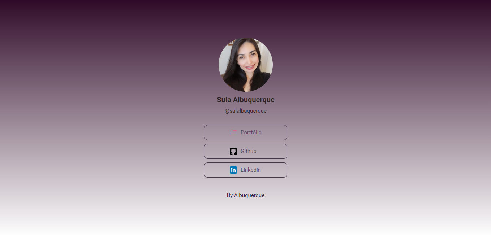

<h1 align="center">Social tree</h1>

<h1 align="center">

</h1>

<h4 align="center">
    Acesse a aplicação online pelo 
    <a href="https://social-tree-flame.vercel.app/">link</a>.
<h4>

##  Sobre

A aplicação traz uma lista de links que poderá ser usada em perfis de redes sociais. 

---

## Tecnologias usadas

O projeto foi desenvolvido utilizando as seguintes tecnologias:

- HTML5;
- CSS;
- VS Code.

---

## Acesso ao projeto
    - git clone <link-repositório> - (clone do repositório)
    - cd <diretório> - (acesso ao diretório)
    - npm install - (instalação das dependências)
    - npm start - (execução do projeto)
   
---